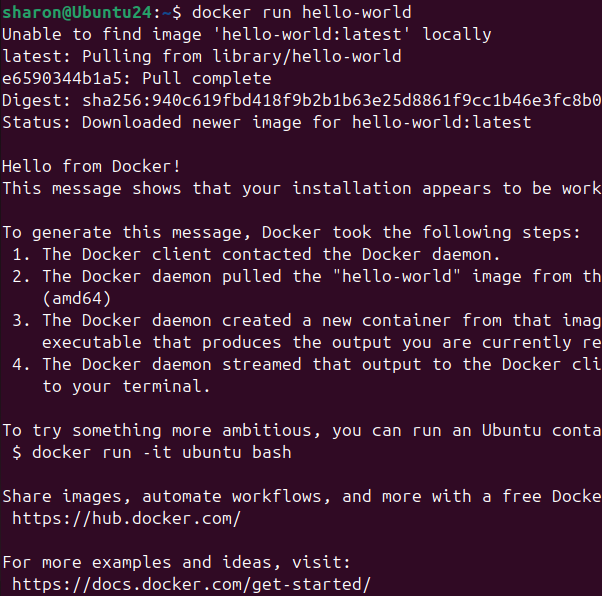
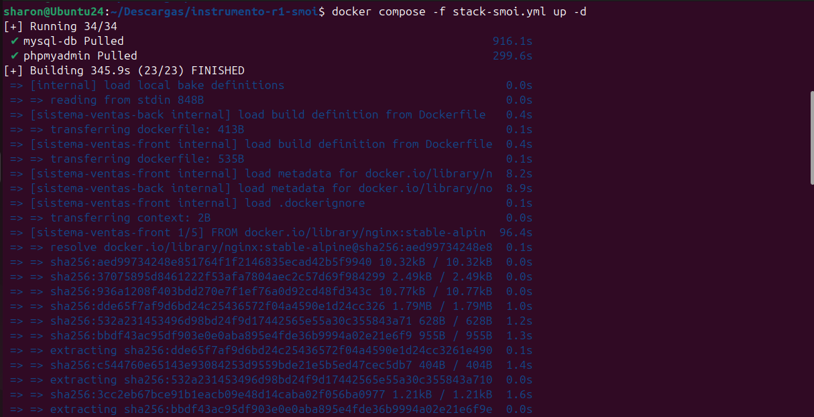
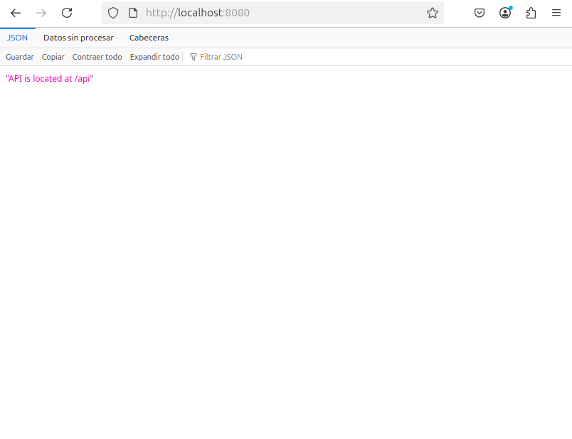

</img>

<h2 style="text-align: center;">Licenciatura en Ingeniería en

Tecnologías de la Información y Comunicación Área Redes Inteligentes y Ciberseguridad</h2>

<h3 style="text-align: center;">Automatización de Infraestructura Digital I</h3>

<h4 style="text-align: center;">Unidad 1. Entornos de desarrollo en la automatización de redes</h4>

<br>**Docente:** Eric Domenzain Morales  
<br>**Tema:** Instrumento R1  
<br>**Nombre del alumno:** Sharon Michelle Olvera Ibarra  
<br>**Número de control:** 1222100815  
<br>**Grupo:** GIRI5091  
<br>

<p style="text-align: right;">Dolores Hidalgo Cuna de la Independencia Nacional, Guanajuato, 09 de julio de 2025.

# Índice

- [Introducción](#introducción)
- [Desarrollo](#desarrollo)
  - [Comandos Básicos](#comandos-básicos)
  - [Descripción de las herramientas utilizadas para automatización](#descripción-de-las-herramientas-utilizadas-para-automatización)
    - [Docker Engine](#docker-engine)
    - [Docker Compose](#docker-compose)
    - [Docker y Swagger (OpenAPI)](#docker-y-swagger-openapi)
  - [Procedimiento de instalación](#procedimiento-de-instalación)
    - [Instalación técnica de herramientas](#instalación-técnica-de-herramientas)
      - [Visual Studio Code](#visual-studio-code)
      - [Plugins y extensiones de Visual Studio Code](#plugins-y-extensiones-de-visual-studio-code)
    - [Instalación técnica de Docker en Ubuntu](#instalación-técnica-de-docker-en-ubuntu)
    - [Instalación técnica de Git](#instalación-técnica-de-git)
- [Evidencia de pruebas de verificación](#evidencia-de-pruebas-de-verificación)
  - [Imagen "hello-world"](#imagen-hello-world)
  - [Ejecución de un archivo yml](#ejecución-de-un-archivo-yml)
- [Conclusión](#conclusión)
- [Bibliografía](#bibliografía)

# Introducción

El presente documento tiene como finalidad mostrar el proceso completo para preparar un entorno de desarrollo moderno enfocado en la automatización de redes. A través de herramientas como Docker, Git y Visual Studio Code, se busca facilitar el despliegue de aplicaciones, su documentación y control de versiones. La intención es explicar de manera práctica cómo estas tecnologías se interconectan para formar una infraestructura robusta, portátil y eficiente.

También se proporciona una guía detallada paso a paso para instalar y configurar estas herramientas en sistemas operativos basados en Linux, como Ubuntu. El objetivo es facilitar el aprendizaje a estudiantes o profesionales que están iniciando en entornos de automatización, ofreciendo además ejemplos de ejecución y verificación.

# Desarrollo


## Comandos Básicos

Lista de comandos básicos de Docker con su respectiva explicación:

- **Listar los contenedores activos e inactivos**
```shell
docker ps -a
```
Este comando muestra una lista de todos los contenedores, estén en ejecución o detenidos. Útil para ver el historial de contenedores utilizados.

- **Inicializar un contenedor existente**
```shell
docker start [nombre_o_ID]
```
Inicia un contenedor que ya ha sido creado anteriormente y está detenido.

- **Crear y ejecutar un nuevo contenedor**
```shell
docker run [nombre_imagen]
```
Descarga (si no existe localmente) y ejecuta una imagen de Docker, creando un nuevo contenedor a partir de ella.

- **Levantar todos los servicios definidos en un archivo docker-compose.yml en segundo plano**
```shell
docker-compose up -d
```
Ejecuta todos los servicios del archivo `docker-compose.yml` sin bloquear la terminal, dejándolos corriendo en segundo plano.

- **Ver los registros (logs) de un contenedor**
```shell
docker logs [nombre_contenedor]
```
Muestra los mensajes generados por un contenedor durante su ejecución. Muy útil para depurar errores.

- **Detener un contenedor en ejecución**
```shell
docker stop [nombre_contenedor]
```
Finaliza la ejecución de un contenedor activo.

- **Eliminar un contenedor**
```shell
docker rm [nombre_o_ID]
```
Borra un contenedor del sistema. El contenedor debe estar detenido para ser eliminado.

- **Eliminar una imagen de Docker**
```shell
docker image rm [nombre_o_ID]
```
Elimina una imagen del sistema local de Docker. No debe haber contenedores creados a partir de esa imagen activos.


## Repositorio de Docker 
[Repositorio](http://hub.docker.com/)

## Crear imagen a partir de un archivo Dockerfile
```shell
docker build -t nameapp:tag --no-cache --build-arg JAR_FILE=target/*.jar .
```

## Levantar un contenedor a partir de una imagen
```shell
docker run -p 80:80 -p 80808:8080 --name containername nameapp:tag
```

# Guía básica de GIT

- **Inicializar GIT**
```shell
git init
```

- **Cambiar el nombre de las ramas**
```shell
git branch -m [rama-anterior] [nuevo-nombre]
git branch -m master main
```

- **Agregar archivos al área de preparación**
```shell
git add .
```

- **Realizar commit**
```shell
git commit -m "Creación del Proyecto"
```

- **Configuración de usuario y correo**
```shell
git config --global user.name "Sharon Olvera"
git config --global user.email "olverasharon31@gmail.com"
```

- **Crear llaves SSH**
```shell
ssh-keygen -t ed25519 -C "olverasharon31@gmail.com"
```

- **Ver clave pública**
```shell
cat C:\Users\sharon\.ssh\id_ed25519.pub
```

- **Descargar imágenes desde archivo YML**
```shell
docker compose -f stackdb.yml pull
```

- **Levantar contenedores desde stackdb.yml**
```shell
docker compose -f stackdb.yml up -d
```

## Descripción de las herramientas utilizadas para automatización

### Docker Engine

Docker Engine permite crear entornos ligeros y portables llamados contenedores. Gracias a su arquitectura cliente-servidor, se pueden ejecutar aplicaciones en cualquier sistema operativo compatible sin preocuparse por dependencias externas.

### Docker Compose

Con Docker Compose se pueden orquestar múltiples contenedores definidos en un solo archivo `docker-compose.yml`. Esto resulta ideal para proyectos que requieren varios servicios (por ejemplo, base de datos, servidor web, etc.).

### Docker y Swagger (OpenAPI)

Swagger ofrece una forma visual de documentar y probar APIs REST. Al combinarlo con Docker, podemos contenerizar herramientas como Swagger UI para facilitar el acceso y pruebas sin instalar software adicional en el sistema operativo host.

## Procedimiento de instalación

### Instalación técnica de herramientas

#### Visual Studio Code

Visual Studio Code es un editor de código ligero pero potente. Soporta múltiples lenguajes y cuenta con una amplia variedad de extensiones.

1. Acceder al sitio: https://code.visualstudio.com/  
2. Descargar el archivo correspondiente al sistema operativo.  
3. Instalar y ejecutar el editor.

#### Plugins y extensiones de Visual Studio Code

1. Ir al apartado de extensiones.  
2. Buscar y agregar extensiones útiles como las de Docker, Git, HTML, Python, etc.

### Instalación técnica de Docker en Ubuntu

1. Agregar repositorios oficiales:
```shell
sudo apt-get update
sudo apt-get install ca-certificates curl
sudo install -m 0755 -d /etc/apt/keyrings
sudo curl -fsSL https://download.docker.com/linux/ubuntu/gpg -o /etc/apt/keyrings/docker.asc
sudo chmod a+r /etc/apt/keyrings/docker.asc
```

2. Agregar el repositorio APT:
```shell
echo   "deb [arch=$(dpkg --print-architecture) signed-by=/etc/apt/keyrings/docker.asc] https://download.docker.com/linux/ubuntu   $(. /etc/os-release && echo "${UBUNTU_CODENAME:-$VERSION_CODENAME}") stable" |   sudo tee /etc/apt/sources.list.d/docker.list > /dev/null
sudo apt-get update
```

3. Instalar Docker:
```shell
sudo apt-get install docker-ce docker-ce-cli containerd.io docker-buildx-plugin docker-compose-plugin
```

4. Ver versiones disponibles:
```shell
apt-cache madison docker-ce | awk '{ print $3 }'
```

5. Instalar versión específica:
```shell
VERSION_STRING=5:28.2.1-1~ubuntu.24.04~noble
sudo apt-get install docker-ce=$VERSION_STRING docker-ce-cli=$VERSION_STRING containerd.io docker-buildx-plugin docker-compose-plugin
```

6. Verificar instalación:
```shell
sudo docker run hello-world
```

7. Post-instalación:
```shell
sudo groupadd docker
sudo usermod -aG docker $USER
newgrp docker
docker run hello-world
```

8. Corregir permisos:
```shell
sudo chown "$USER":"$USER" /home/"$USER"/.docker -R
sudo chmod g+rwx "$HOME/.docker" -R
```

### Instalación técnica de Git

1. Ir al sitio oficial: https://git-scm.com/downloads  
2. Descargar el instalador correspondiente.  
3. Ejecutar instalación con opciones por defecto.  
4. Verificar instalación:
```shell
git --version
```

5. Configurar Git:
```shell
git config --global user.name "Sharon Olvera"
git config --global user.email "olverasharon31@gmail.com"
```

6. Ver configuración actual:
```shell
git config --list
```

## Evidencia de pruebas de verificación

### Imagen "hello-world"


### Ejecución de un archivo yml




# Conclusión

Dominar herramientas como Docker, Git, Swagger y Visual Studio Code representa una gran ventaja para cualquier desarrollador moderno. La automatización de entornos, la documentación de servicios y el control de versiones permiten construir proyectos más estables, reproducibles y colaborativos.

A través de esta guía se logró construir y verificar un entorno funcional utilizando contenedores, demostrando el valor práctico de estas herramientas en escenarios reales. Esto forma la base para trabajar con metodologías como DevOps, donde la integración y despliegue continuo son esenciales.

# Bibliografía

1. Docker. *Install Docker Engine on Ubuntu*. https://docs.docker.com/engine/install/ubuntu/  
2. Docker. *Post-installation steps for Linux*. https://docs.docker.com/engine/install/linux-postinstall/  
3. Visual Studio Code. *Download VSCode*. https://code.visualstudio.com/  
4. Git SCM. *Descargas oficiales de Git*. https://git-scm.com/downloads  
5. LinuxTechi. *Cómo instalar Docker en Linux Mint*. http://www.linuxtechi.com/how-to-install-docker-on-linux-mint/